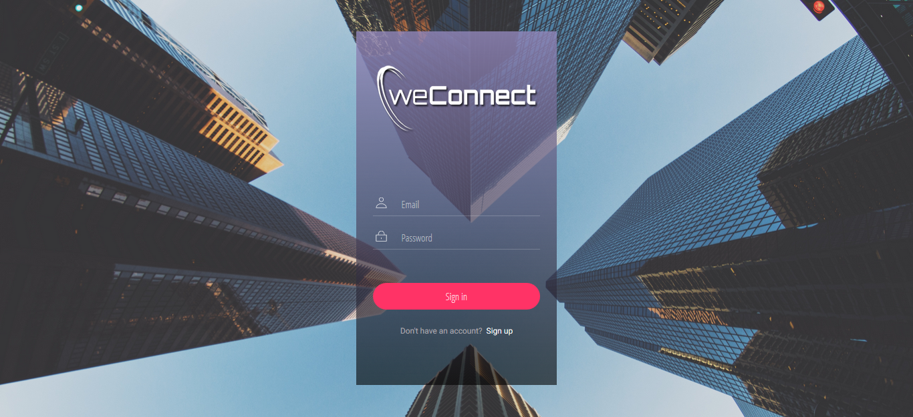
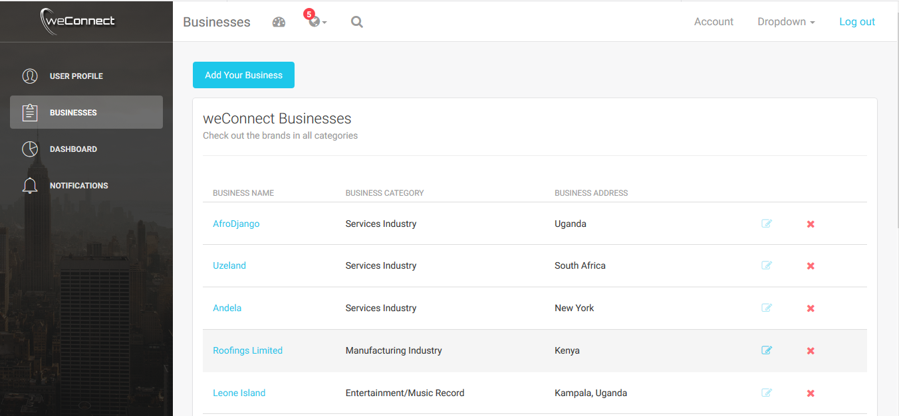

[](https://travis-ci.org/pktahinduka/weConnect)
[](https://coveralls.io/github/pktahinduka/weConnect?branch=travisCI)

# weConnect
weConnect is a platform that allows users to create and expose businesses to the world, while potential clients log in to view and review the businesses. weConnect is enriched with a Python backend and a ReactJS frontend as the view in the MVC model adapted for the project. It also uses Postgres Database for data storage and retrieval.

#### weConnect Screenshots


 

## Getting Started

These instructions will get you a copy of the project up and running on your local machine for development and testing purposes. See deployment for notes on how to deploy the project on a live system.

### Prerequisites

* Python3.6
* PostgreSQL

#### Installation

Please ensure that development libraries for [PostgreSQL](http://techarena51.com/index.php/flask-sqlalchemy-postgresql-tutorial/) are installed.

#### Step 1: Clone the project to your application folder.

    git clone https://github.com/pktahinduka/weConnect

#### Step 2: Install the requirements and add your Database configuration details.

    pip install -r requirements.txt

    vim config.py
    Fill in your database username, password, name, host etc

Clone the repo:

For HTTPS
```
$ git clone https://github.com/pktahinduka/weConnect.git
```


Change Directory into the project folder
```
$ cd weConnect
```

Create a virtual environment with Python 3.6
```
$ virtualenv --python=python3.6 [your_environment_name]
```

Activate the virtual environment you have just created
```
$ source your_environment_name/bin/activate
```

Install the application's dependencies from requirements.txt to the virtual environment
```
$ (your_environment_name) pip install -r requirements.txt
```

Create the database:
For Postgres
```
$ createdb users_dev
$ createdb users_test
```

For other databases modify the `instance/config.py`

Migrations:
```
$ (your_environment_name) python manage.py db init
$ (your_environment_name) python manage.py db migrate
$ (your_environment_name) python manage.py db upgrade
```    

#### Step 3: Set environment variables 
     
     - set APP_SETTINGS=project.config.DevelopmentConfig
     - set DATABASE_URL=postgres://postgres:<your_postgres_password>@localhost:5432/users_dev
     - set DATABASE_TEST_URL=postgres://postgres:<your_postgres_password>@localhost:5432/users_test
     - set SECRET_KEY=change_me
     
#### Step 4: Run the application 
     
     - python manage.py runserver -p 5555

#### Step 5: (Optional) Run the ReactJS front end application at [weConnect-ReactJs](https://github.com/pktahinduka/weConnect-ReactJs)

#### Step 6: Run tests for the routes and configurations
    
     - python manage.py test

#### Step 7: Run coverage for the routes and configurations
    
     - python manage.py cov


### Specifications for the weConnect API
```
ENDPOINT                                             FUNCTIONALITY                          PUBLIC ACCESS

POST    /api/auth/login                              Logs a user in                         TRUE
POST    /api/auth/register                           Register a user                        TRUE
GET     /api/auth/status                             Check if a user is logged in           TRUE
POST    /api/auth/reset-password                     Reset user password                    TRUE
POST    /api/auth/logout                             Log a user out                         FALSE
POST    /api/businesses                              Create a new business                  FALSE
GET     /api/businesses                              List all the created businesses        FALSE
GET     /api/businesses/<businessId>                 Get a single business                  FALSE 
PUT     /api/businesses/<businessId>                 Update this business                   FALSE
DELETE  /api/businesses/<businessId>                 Delete a particular business           FALSE
POST    /api/businesses/<businessId>/reviews         Create a review about a business       FALSE
GET     /api/businesses/<businessId>/reviews         List all reviews about a business      FALSE

```


**Contributions are highly welcomed and appreciated**

## Libraries
[Flask](http://flask.pocoo.org/) - Flask is a microframework for Python based on Werkzeug, Jinja 2 and good intentions. 

[SQLAlchemy](https://www.sqlalchemy.org/) - SQLAlchemy is the Python SQL toolkit and Object Relational Mapper that gives application developers the full power and flexibility of SQL.


[SQLAlchemy]() - SQLAlchemy


## Authors

* **Peter Tahinduka**

## Acknowledgments

* Google Inc.


